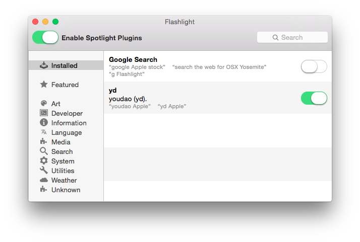
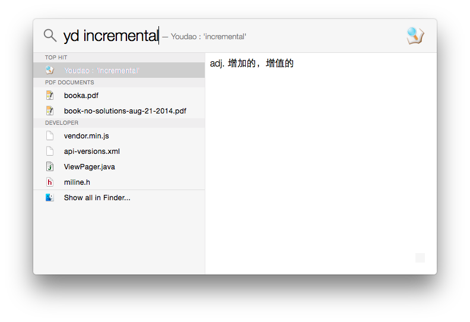

Spotlight-YoudaoDict
====================

This is a plugin bundle for Spotlight on OS X. It is run based on [Flashlight](https://github.com/nate-parrott/Flashlight).

How to use it?
------------
1. Install ```Flashlight.app``` in Flashlight's [website](https://github.com/nate-parrott/Flashlight).
2. Clone the repository and copy the ```youdao.bundle``` into ```/Users/yourUserName/Library/FlashlightPlugins```
3. Open ```Flashlight``` and you will see it would work.

	
4. Type ```yd incremental``` in Spotlight and hoho~ You get it.
	
	